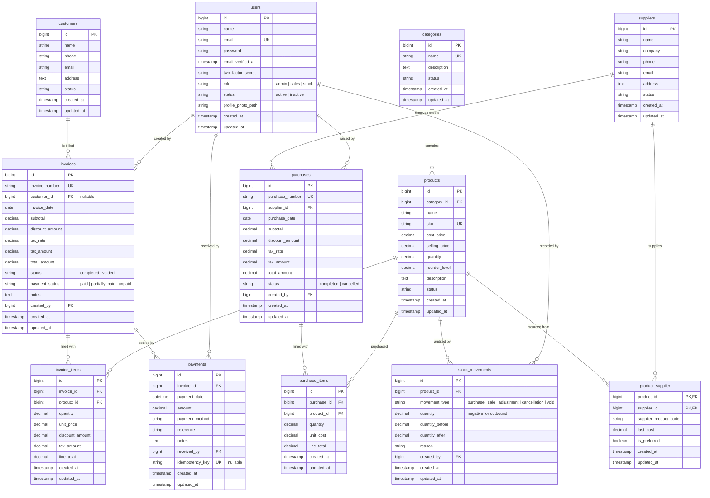

# StockPilot — Entity Relationship Diagram

The database is a single business schema with three logical areas: master
data, purchasing and sales/payments, plus the stock movement audit trail.

Roles are enforced at the application layer (`App\Enums\UserRole`, policies and
`role:` middleware); users.payments.idempotency_key guards against duplicate
payment submissions.

## Notes

- **Movements**: every purchase, sale, manual stock adjustment, cancelled
  purchase and voided invoice appends a `stock_movements` row kept in sync with
  `products.quantity` inside database transactions.
- **Financial state**: invoice money state is derived from `invoices.payment_status`
  plus the sum of `payments.amount`, and customer statements / outstanding
  reports recompute a running balance from invoices and payments.
- **Soft deletion**: financial and stock documents (`invoices`, `purchases`,
  `payments`, `stock_movements`) are never deleted; master data rows are
  deactivated via their `status` column instead.
- **References**: all `created_by` / `received_by` foreign keys point to `users.id`;
  document dates may not be backdated beyond
  `stockpilot.document_date_lookback_days` (default 365) or set in the future.